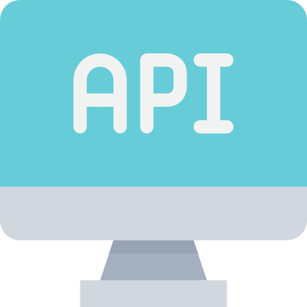

<!-- PROJECT LOGO -->
<br />
<p align="center">
  <a href="https://github.com/Aaryan-R-S/Hackathon-UIDAI-2021">
    
  </a>

  <h3 align="center">Address Formatting API</h3>

  <p align="center">
    An API that formats the address present in raw form to a valid formatted UIDAI Addres
    <br />
    <strong>Explore the docs »</strong>
    <br />
    <br />
    <a href="https://github.com/Aaryan-R-S/Hackathon-UIDAI-2021/tree/master/demo">View Demo</a>
    ·
    <a href="https://github.com/Aaryan-R-S/Hackathon-UIDAI-2021/issues">Report Bug</a>
    ·
    <a href="https://github.com/Aaryan-R-S/Hackathon-UIDAI-2021/issues">Request Feature</a>
    <br />
</p>


**See Demo** -> [Click Here](https://github.com/Aaryan-R-S/Hackathon-UIDAI-2021/tree/master/demo)
<br>
**Source Code** -> [Click Here](https://github.com/Aaryan-R-S/Hackathon-UIDAI-2021)
<br>

<!-- TABLE OF CONTENTS -->
<details open="open">
  <summary>Table of Contents</summary>
  <ol>
    <li>
      <a href="#about-the-project">About The Project</a>
      <ul>
        <li><a href="#built-with">Built With</a></li>
      </ul>
    </li>
    <li>
      <a href="#getting-started">Getting Started</a>
      <ul>
        <li><a href="#prerequisites">Prerequisites</a></li>
        <li><a href="#installation">Installation</a></li>
      </ul>
    </li>
    <li><a href="#roadmap">Roadmap</a></li>
    <li><a href="#contact">Contact</a></li>
    <li><a href="#acknowledgements">Acknowledgements</a></li>
  </ol>
</details>


<!-- ABOUT THE PROJECT -->
## About The Project

![Product Name Screen Shot][product-screenshot]
<br>

![Product Name Screen Shot][product-screenshots]
<br>

![Product Name Screen Shot][product-screenshotss]

This is an Python API which is developed using Flask, requests and Flask restful python modules!

### Built With

* [Python](https://www.python.org/)
* [GitHub](https://github.com)


<!-- GETTING STARTED -->
## Getting Started

To get a local copy up and running follow these simple steps.

### Prerequisites


1. Basic understanding of Python (Tutorials: [English ](https://youtu.be/_uQrJ0TkZlc)| [Hindi](https://youtu.be/gfDE2a7MKjA))
2. Python installed on your computer ([Download from Here](https://www.python.org/downloads/))
3. GitHub Account ([Sign Up](https://github.com))


### Installation

- Clone the repo
   ```sh
   git clone https://github.com/Aaryan-R-S/Hackathon-UIDAI-2021.git
   ```
- Python Modules
  - `pip install requests`
  - `pip install flask` 
  - `pip install flask-restful` 


<!-- ROADMAP -->
## Roadmap

- Clone the repo and open it in suitable IDE for complete project backend code. 
- Then run the API by running python file `API.py`. 
  ```sh
  python ./API.py
  ```
- To make request open the browser and paste `http://127.0.0.1:5000?raw={address separated by commas}`.


<!-- CONTACT -->
## Contact

- Aadit Kant Jha - aadit20001@iiitd.ac.in
- Aaryan Raj Saxena - aaryan20004@iiitd.ac.in
- Muskan Yadav - muskan20087@iiitd.ac.in
- Ishaan Marwah - ishaan20068@iiitd.ac.in
- Yogesh Kaushik - yogesh200163@iiitd.ac.in


Project Link - [https://github.com/Aaryan-R-S/Hackathon-UIDAI-2021](https://github.com/Aaryan-R-S/Hackathon-UIDAI-2021)


<!-- ACKNOWLEDGEMENTS -->
## Acknowledgements
* [Python Tutorial @Code With Harry](https://www.youtube.com/playlist?list=PLu0W_9lII9agICnT8t4iYVSZ3eykIAOME)
* [Create API in Python @James Briggs](https://towardsdatascience.com/the-right-way-to-build-an-api-with-python-cd08ab285f8f)
* [Best README Template](https://github.com/othneildrew/Best-README-Template)
* [Flaticon](https://flaticon.com)


<!-- MARKDOWN LINKS & IMAGES -->
[product-screenshot]: readme-images/screenshot.png
[product-screenshots]: readme-images/screenshots.png
[product-screenshotss]: readme-images/screenshotss.png
